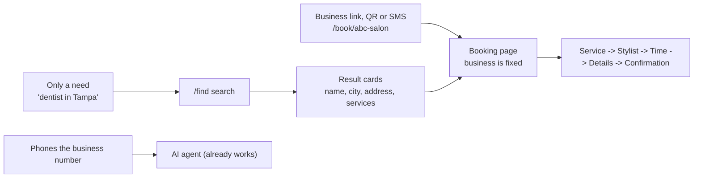

# Customer journey

How a customer finds the right business, books without phoning, is recognised when they come back, and what they can see.
Technical detail: [DISCOVERY_AND_LISTING.md](DISCOVERY_AND_LISTING.md), [PUBLIC_BOOKING_API.md](PUBLIC_BOOKING_API.md), [PORTAL_SPEC.md](PORTAL_SPEC.md). Status per item is on the Jira board (parents 16 to 19).

## 1. Three ways a customer reaches a business

- **Direct link** (Instagram, website, Google profile, QR poster, receipts, SMS from the AI agent): no ambiguity, the business name and address are on every screen.
- **Directory `/find`**: search by business name, service word ("teeth cleaning"), category (Dentist, Barber, Salon...) and city. Cards show the street address so two "ABC Salon"s can be told apart.
- **Phone**: the number called decides the business. Unchanged.

**Wrong-business guardrails:** name and address in every step header; breadcrumb "Find a business > ABC Dentist > Book"; the confirmation screen, SMS and email repeat name, address and a map link; "Not the right business?" goes back to `/find`; the customer can cancel for free with the link in the SMS.

## 2. Who is the customer (identity)

- Identity = **phone number, per business**. The internal customer ID is a UUID; customers never remember an ID, phone number plus a one-time code is their login (portal, stage 2).
- **Old customer** (already in the system from phone calls) books on the web with the same phone: matched to the **same customer record**, so calls, web and dashboard bookings sit on one profile. Numbers without a country code default to +1 (done).
- **New customer**: a record is created at the first booking. No password, no account step.
- **Different phone or email later**: staff see a possible duplicate and can merge (later).
- **Privacy rule:** the public pages never pre-fill a name or say "welcome back" from a phone number alone. That would tell strangers who is a customer.

| Level | How | Can do |
|---|---|---|
| Guest | Public link | Book |
| Link holder | Signed link in the SMS/email (`/manage/[token]`, exists) | Reschedule or cancel that one booking |
| Verified customer (stage 2) | SMS code or email link | "My appointments": upcoming, past, cancelled, preferences, data export and delete |
| Staff | Dashboard | Everything for their business; each booking shows where it came from (phone, web, dashboard) |

## 3. Salon vs dentist

Every business is its own tenant: own link, services, staff, hours, phone number and customers. The URL picks the tenant and every query is scoped to it. The same person booking a salon and a dentist has **two separate customer profiles**, and nothing crosses over. Hair and facial at the same salon is just the service picker. A stylist ("Jessica") is the staff picker, filtered by the services she performs, or "Any available".

## 4. Journeys

| # | Scenario | What happens | Tests |
|---|---|---|---|
| J1 | New customer, business link | 5 steps, booking and customer created, SMS/email with manage link | PB-01 |
| J2 | Returning phone customer books on web | Same customer id, history unified, no pre-fill | MT-03, PB-02 |
| J3 | Customer wants all their appointments | Stage 2 portal after a code | later |
| J4 | Same person, salon and dentist | Two profiles, nothing shared | MT-01 |
| J5 | Wants Jessica, or anyone | Staff filtered by service; "Any" picks a free staff member when booking | PB-03..PB-05 |
| J6 | Two people take the same slot | One wins, the other sees "just taken" with fresh times | PB-06 |
| J7 | Double click or retry | One booking (idempotency key) | PB-07 |
| J8 | Reschedule or cancel | Manage link (exists) | existing |
| J9 | SMS or email not delivered | Confirmation is always shown on screen; failure shows in Exceptions | existing |
| J10 | Business closed or suspended | Friendly page, no data leaked | PB-09 |
| J11 | Customer prefers to call | Voice path unchanged, booking source = phone | existing |
| J12 | Opt-out and data rights | STOP exists; portal export/delete in stage 2 | later |

## 5. Booking page steps

1. **Service** (name, length, price). 2. **Stylist** (only staff who do that service, plus "Any available"). 3. **Date and time** (slots shown in the business's timezone). 4. **Your details** (name, phone, optional email, a consent checkbox for SMS and email confirmations; the wording is stored). 5. **Confirmation** (what, when, who, where, plus the manage link).

Closed, unlisted-but-linked, suspended and "no services yet" businesses each have their own plain message.

## 6. What stays out of scope here
No marketplace ranking or reviews, no deposits or payments (Plan: payments), no website chat. A customer cannot see other customers' data, and never sees data from a business they did not choose.
